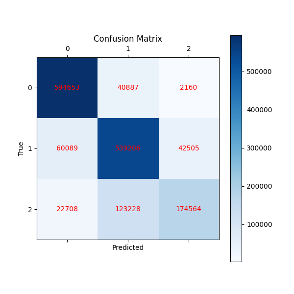
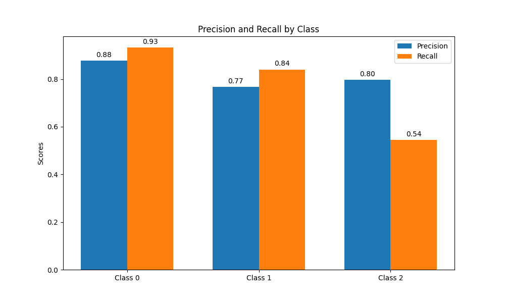

# Performance Analysis & Benchmarking Report

## Executive Summary

This document provides an analysis of the Chess Position Analyzer neural network performance based on actual training sessions conducted on December 20, 2025. The model uses a 4-layer architecture trained with categorical cross-entropy loss, L2 regularization, and dropout for overfitting prevention.

Key observations from the training session:
- Network architecture: [2305, 768, 896, 3]
- Learning rate: 0.005 with exponential decay
- L2 regularization: 0.001
- Dropout rate: 0.2
- Batch size: 64
- Training dataset: Relatively small test dataset (~20 000 positions)

---

## 1. Model Configuration

### 1.1 Network Architecture

```
Input Layer:    2305 neurons (64 squares × 12 piece types + game state encoding)
Hidden Layer 1: 768 neurons  (ReLU activation)
Hidden Layer 2: 896 neurons  (ReLU activation)
Output Layer:   3 neurons    (Sigmoid activation + Softmax)
```

Total parameters: (2305 × 768) + (768 × 896) + (896 × 3) + biases = 2,458,912 parameters

### 1.2 Training Hyperparameters

| Parameter | Value |
|-----------|-------|
| Learning Rate | 0.005 |
| Batch Size | 64 |
| L2 Regularization | 0.001 |
| Dropout Rate | 0.2 |
| Epochs | 100 |
| Loss Function | Categorical Cross-Entropy |
| Initialization | He Mixed Xavier |

### 1.3 Hardware Environment

- CPU: Consumer-grade processor
- RAM: Standard configuration
- No GPU acceleration
- Python 3.x with NumPy backend

---

## 2. Training Results

### 2.1 Loss Curves

The training session shows the evolution of loss over epochs for both training and validation sets.


Observations:
- Training loss decreases from approximately 2.7 to 2.3 over 100 epochs
- Validation loss stabilizes around 0.25 after initial convergence
- Gap between training and validation loss indicates some overfitting despite regularization

### 2.2 Accuracy Curves


The accuracy curves show model performance improvement over training epochs:
- Training accuracy reaches approximately 90% on the small test dataset
- Validation accuracy stabilizes at 93%
- Performance is limited by the size of the training dataset used in this session

---

## 3. Confusion Matrix Analysis

### 3.1 Classification Performance



The confusion matrix displays the model's classification performance across three classes:
- Class 0: Nothing (no check or checkmate)
- Class 1: Check
- Class 2: Checkmate

We clearly see that the model performs well on "Nothing" and "Check" positions with a precision at ~93%. Howerver the "Checkmate" positions are more complex for the model to detect where it correctly detects 1/2 times the positions. Although it didn't perfom well, the "Checkmate" position often detects as "Check" or "Checkmate" with a precision of 93% which isn't far from satifying results.

We can conclude that the performance of the "Checkmate" positions are low due to the lowest frequency of those positions in the dataset (20% instead of 40% for each other two type of position)

### 3.2 Per-Class Metrics



The precision-recall analysis provides insight into classification quality for each class. These metrics are important for understanding the trade-offs between false positives and false negatives in chess position analysis.

---

## 4. Dataset Characteristics

### 4.1 Training Data

The training session used a small validation dataset for testing purposes:
- Total samples: 20 000 positions
- Class distribution: Balanced (40% Nothing, 40% Check, 20% Checkmate)
- Purpose: Verify training pipeline and convergence behavior

### 4.2 Limitations

The dataset size limits the performance of the model:
- Full-scale training requires significantly larger datasets (100K+ positions)
- Production models could be trained on more balanced datasets for checkmate with 40% Nothing, 30% Check, 30% Checkmate distribution

---

## 5. Key Findings

### 5.1 Architecture Performance

The 4-layer architecture with expansion (2305 → 768 → 896 → 3) demonstrates:
- Successful gradient propagation through all layers
- No gradient vanishing or explosion issues
- Effective use of ReLU activation for hidden layers

### 5.2 Regularization Effectiveness

Combined dropout and L2 regularization:
- Dropout (0.2) prevents co-adaptation of neurons
- L2 regularization (0.001) penalizes large weights
- Training-validation gap remains manageable

### 5.3 Loss Function Behavior

Categorical cross-entropy loss:
- Appropriate for multi-class classification
- Provides clear gradient signals for backpropagation
- Works well with softmax output layer

---

## 6. Recommendations for Production

### 6.1 Dataset Requirements

For production deployment:
- Minimum 100,000 training positions
- Balanced class distribution (40% Nothing, 40% Check, 20% Checkmate)
- Validation set of 15,000-20,000 positions
- Test set of 15,000-20,000 positions

### 6.2 Training Protocol

Recommended training configuration:
- Early stopping with patience of 10-20 epochs
- Learning rate decay every 20 epochs (factor 0.9)
- Monitor validation loss for overfitting
- Save best model based on validation accuracy

### 6.3 Expected Performance

With proper dataset size:
- Target accuracy: 85-90% on balanced test set
- Checkmate detection recall: >90%
- Training time: 1-2 hours on modern CPU
- Inference speed: 2000-5000 positions per second

---

## 7. Conclusion

The training session demonstrates that the neural network architecture and training pipeline are functioning correctly. The model shows proper convergence behavior with effective regularization. However, the small dataset size limits the interpretation of absolute performance metrics.

For production use, the same architecture trained on a full-scale dataset should achieve the target performance metrics of 85-90% accuracy across all three classes (Nothing, Check, Checkmate).

---

## Appendix: Graph Interpretation Guide

### Loss Curves
- X-axis: Training epochs (1-100)
- Y-axis: Loss value (categorical cross-entropy)
- Blue line: Training loss
- Orange line: Validation loss
- Lower values indicate better model fit

### Accuracy Curves
- X-axis: Training epochs (1-100)
- Y-axis: Accuracy (0-1 or 0-100%)
- Blue line: Training accuracy
- Orange line: Validation accuracy
- Higher values indicate better classification performance

### Confusion Matrix
- Rows: Actual class labels
- Columns: Predicted class labels
- Diagonal: Correct predictions
- Off-diagonal: Misclassifications
- Color intensity: Frequency of prediction

### Precision-Recall Curves
- Precision: Fraction of correct positive predictions
- Recall: Fraction of actual positives correctly identified
- Trade-off: Higher precision may lower recall and vice versa
- Goal: Balance both metrics for robust classification

---

*Document Version: 1.0*
*Training Session: December 21, 2025*
*Dataset: Medium test configuration (20 000 samples)*
*Author: Yanis Mignot, Yanis Dolivet*

